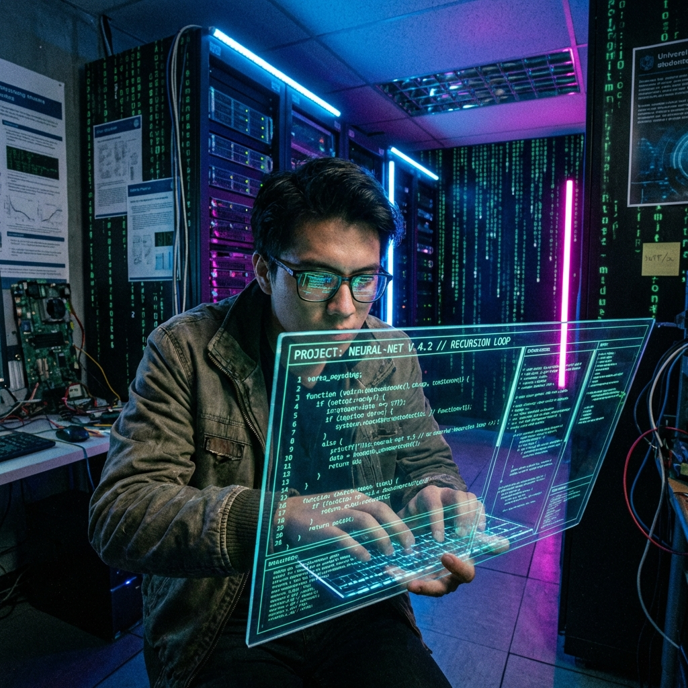
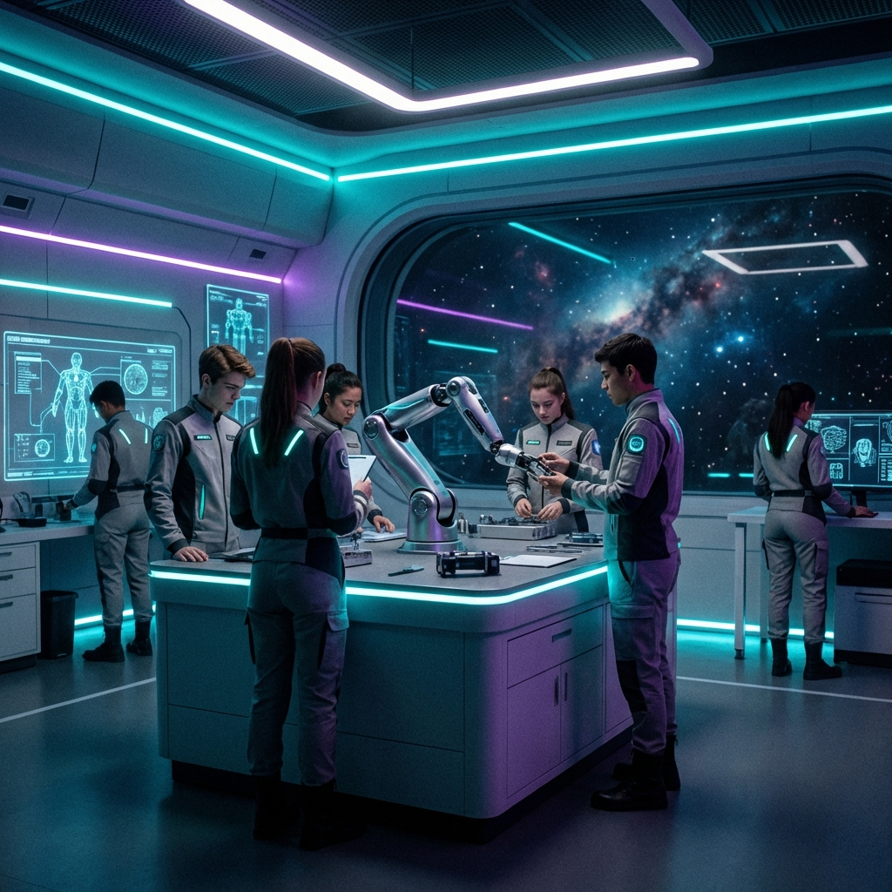

# 🚀 CLB STEM - THPT Đông Hà

<div align="center">


**Cổng đăng ký thành viên CLB STEM với giao diện hiện đại, hiệu ứng cinematic**

[🌐 Demo Live](https://arcis-u.github.io/ag-web) • [📝 Báo lỗi](https://github.com/Arcis-u/ag-web/issues)

</div>

---

## ✨ Tính năng nổi bật

<table>
<tr>
<td width="50%">

### 🎨 Giao diện Cinematic
- Theme **Deep Space Iridescence** tối với điểm nhấn neon
- Particle mesh tương tác theo chuột
- Hiệu ứng parallax mượt mà
- Typography hiện đại với font Playfair Display & Space Mono

</td>
<td width="50%">

### ⚡ Hiệu suất cao
- Smooth scrolling với **Lenis**
- Animation mượt với **Framer Motion**
- Responsive trên mọi thiết bị
- Tối ưu hóa render với React

</td>
</tr>
<tr>
<td width="50%">

### 📋 Form đăng ký thông minh
- Multi-step form với transition đẹp mắt
- Validation real-time với thông báo tiếng Việt
- Tự động gửi email đăng ký
- 4 ban hoạt động: Lập trình, Robot, Khoa học, Truyền thông

</td>
<td width="50%">

### 🎭 Hiệu ứng đặc biệt
- **Scramble Text** - chữ giải mã như trong phim
- **Glitch Image** - hiệu ứng nhiễu ảnh
- **CRT Overlay** - màn hình cũ retro
- **Tech Grid** - lưới kỹ thuật nền

</td>
</tr>
</table>

---

## 📸 Screenshots

<div align="center">

| Hero Section | Tracks Section |
|:---:|:---:|
|  |  |

</div>

---

## 🛠️ Công nghệ sử dụng

| Công nghệ | Mô tả |
|-----------|-------|
|  | UI Library |
|  | Build Tool |
|  | Styling |
|  | Animations |
|  | Smooth Scroll |

---

## 🚀 Cài đặt & Chạy

### Yêu cầu
- Node.js >= 18.x
- npm hoặc yarn

### Các bước thực hiện

```bash
# 1. Clone repository
git clone https://github.com/Arcis-u/ag-web.git

# 2. Di chuyển vào thư mục
cd ag-web

# 3. Cài đặt dependencies
npm install

# 4. Chạy development server
npm run dev

# 5. Mở trình duyệt tại http://localhost:5173
```

### Build cho Production

```bash
npm run build
npm run preview
```

---

## 📁 Cấu trúc thư mục

```
ag-web/
├── 📂 public/
│   └── 📂 assets/          # Hình ảnh
├── 📂 src/
│   ├── 📄 App.jsx          # Component chính
│   ├── 📄 main.jsx         # Entry point
│   └── 📄 index.css        # Global styles
├── 📄 index.html
├── 📄 package.json
├── 📄 tailwind.config.js
├── 📄 vite.config.js
└── 📄 README.md
```

---

## 🎯 Các ban hoạt động

| Ban | Mô tả | Công nghệ |
|-----|-------|-----------|
| 💻 **Lập trình** | Algorithms, Web Dev, AI/ML | NextJS, Python, TensorFlow |
| 🤖 **Robot** | Arduino, IoT, Circuit Design | C++, Electronics, CAD |
| 🔬 **Khoa học** | Physics, Chemistry, Biology | Lab Work, Research, Analysis |
| 📱 **Truyền thông** | Graphics, Video, Brand Identity | Figma, Blender, Adobe |

---

## 📧 Liên hệ

<div align="center">

| Liên hệ | Thông tin |
|---------|-----------|
| 📧 Email | anhquan130408@gmail.com |
| 🏫 Trường | THPT Đông Hà |
| 📍 Địa chỉ | Đông Hà, Quảng Trị |

</div>

---

## 📝 License

Dự án được phân phối dưới giấy phép **MIT**. Xem file [LICENSE](LICENSE) để biết thêm chi tiết.

---

<div align="center">

**Made with ❤️ by CLB STEM - THPT Đông Hà**


</div>
